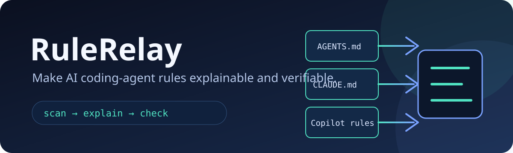
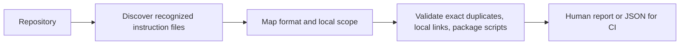

<p align="center">
  
</p>

<p align="center">
  <strong>See which AI coding-agent instructions apply, catch instruction drift, and fail CI before stale rules mislead an agent.</strong>
</p>

<p align="center">
  <a href="https://github.com/pangxueyuan2-creator/rule-relay/actions"></a>
  <a href="LICENSE"></a>
  <a href="https://github.com/pangxueyuan2-creator/rule-relay/releases"></a>
</p>

## The problem

Modern repositories often carry overlapping instructions for Copilot, Claude Code, Gemini, Cursor, and generic coding agents. A root `AGENTS.md`, a nested `AGENTS.md`, `.github/copilot-instructions.md`, and path-specific rules can coexist. Once a repository has more than one agent, maintainers need quick answers to three practical questions:

> **Which instructions can affect this file? Which ones have drifted? Which referenced commands or documents are already stale?**

RuleRelay is a **local, deterministic CLI** for that job. It reads recognized instruction files without calling an AI model or executing commands embedded in your documentation.

## Ten-second demo

```text
$ rule-relay explain packages/api/src/server.ts

RuleRelay — rules visible to packages/api/src/server.ts

  1. packages/api/AGENTS.md [agents-md] — most specific discovered rule
  2. AGENTS.md [agents-md]
  3. .github/copilot-instructions.md [copilot]
  4. .github/instructions/api.instructions.md [copilot]
```

```text
$ rule-relay check .

▲ AGENTS.md: Instruction content is duplicated across: AGENTS.md, .github/copilot-instructions.md
✖ AGENTS.md: Local Markdown link does not exist: docs/contributing.md
✖ packages/api/AGENTS.md: Referenced package script is not declared: api-test
```

## Quick start

RuleRelay requires **Node.js 20 or newer**. It is not yet published to the npm registry. For a one-off run, execute the pinned GitHub Release package without adding it to your project:

```bash
npm exec --yes \
  --package=https://github.com/pangxueyuan2-creator/rule-relay/releases/download/v0.1.1/rule-relay-0.1.1.tgz \
  -- rule-relay scan .

npm exec --yes \
  --package=https://github.com/pangxueyuan2-creator/rule-relay/releases/download/v0.1.1/rule-relay-0.1.1.tgz \
  -- rule-relay explain src/server.ts

npm exec --yes \
  --package=https://github.com/pangxueyuan2-creator/rule-relay/releases/download/v0.1.1/rule-relay-0.1.1.tgz \
  -- rule-relay check .
```

To build from source instead, clone the repository, run `pnpm install --frozen-lockfile --ignore-scripts`, then `pnpm build` and `pnpm exec rule-relay check .`.

`check` exits non-zero for validation errors, making it suitable for continuous integration. Add `--strict` to also fail on warnings such as exact duplicate instruction files.

## What it checks today

| Capability | What RuleRelay does | Why it is useful |
| --- | --- | --- |
| Discovery | Finds `AGENTS.md`, `.github/copilot-instructions.md`, `.github/instructions/*.instructions.md`, `CLAUDE.md`, `GEMINI.md`, and `.cursorrules`. | Replaces hidden rule sprawl with one auditable inventory. |
| Scope explanation | Lists discovered instructions relevant to a target path and orders local `AGENTS.md` files by specificity. | Makes agent context easier to reason about during review. |
| Duplication | Detects exact normalized duplicate instruction documents. | Helps establish one canonical source rather than silently copied policy. |
| Link checks | Validates local Markdown link targets. | Catches documentation pointers that no longer exist. |
| Command checks | Confirms inline `npm`, `pnpm`, `yarn`, and `bun` package-script references exist in the nearest `package.json`. | Keeps agent handoff commands actionable. |
| CI output | Supports `--json`, deterministic exit codes, and a strict warning mode. | Integrates cleanly with scripts and automation. |

## Commands

| Command | Purpose |
| --- | --- |
| `rule-relay scan [directory] [--json]` | Discover recognized files and report findings. |
| `rule-relay check [directory] [--strict] [--json]` | Run validation and return a CI-friendly exit code. |
| `rule-relay explain <target-path> [directory] [--json]` | Explain the discovered instruction files relevant to a target path. |
| `rule-relay init [directory]` | Create a minimal root `AGENTS.md`, refusing to overwrite one. |

## GitHub Actions example

```yaml
name: Agent instruction hygiene

on:
  pull_request:
  push:
    branches: [main]

jobs:
  rule-relay:
    runs-on: ubuntu-latest
    steps:
      - uses: actions/checkout@v7
      - uses: actions/setup-node@v7
        with:
          node-version: 22
      - name: Install pinned RuleRelay release
        run: npm install --ignore-scripts --no-save https://github.com/pangxueyuan2-creator/rule-relay/releases/download/v0.1.1/rule-relay-0.1.1.tgz
      - run: npx --no-install rule-relay check . --strict
```

## How it works



RuleRelay intentionally limits itself to deterministic, inspectable checks. It does **not** promise to reconstruct a proprietary model’s full prompt or to judge whether two natural-language policies have the same meaning.

## Compatibility and boundaries

The discovery rules are grounded in the published behavior of GitHub Copilot and VS Code. GitHub documents repository-wide Copilot instructions, path-specific instruction files, and multiple scoped `AGENTS.md` files; VS Code also documents compatibility with `CLAUDE.md` and multi-agent workspaces.[^github-docs] [^vscode-docs]

Path-specific `.instructions.md` files are reported as **potentially applicable** in v0.1. RuleRelay extracts their simple scope hint for ordering, but does not yet evaluate every VS Code glob expression or private runtime rule. This conservative behavior is deliberate: the tool should explain what it knows rather than make an unprovable context claim.

## Security and privacy

RuleRelay operates locally. It does not upload repository data, require tokens, or execute commands extracted from instruction content. `init` only creates a new `AGENTS.md` when one does not already exist. See [SECURITY.md](SECURITY.md) for disclosure guidance and the full threat boundary.

## Development

```bash
pnpm install --ignore-scripts
pnpm verify
pnpm demo
```

`pnpm verify` runs TypeScript checking, ESLint, tests, and the production build. The repository includes fixtures for duplicate instructions, stale links, missing package scripts, nested scopes, and clean repositories.

## Contributing

Contributions that improve format adapters, make scope explanations more precise, or add high-signal validation checks are welcome. Please run `pnpm verify` before opening a pull request and explain the documented tool behavior used to justify any adapter change. See [CONTRIBUTING.md](CONTRIBUTING.md).

## License

RuleRelay is released under the [MIT License](LICENSE).

[^github-docs]: [GitHub Docs — Adding repository custom instructions for GitHub Copilot](https://docs.github.com/en/copilot/how-tos/copilot-on-github/customize-copilot/add-custom-instructions/add-repository-instructions)
[^vscode-docs]: [Visual Studio Code Docs — Use custom instructions](https://code.visualstudio.com/docs/agent-customization/custom-instructions)
